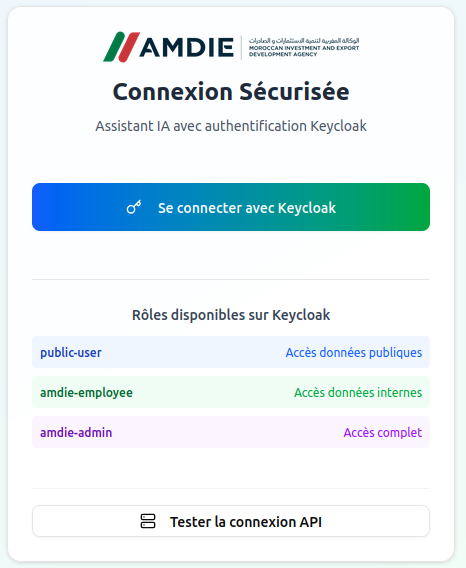
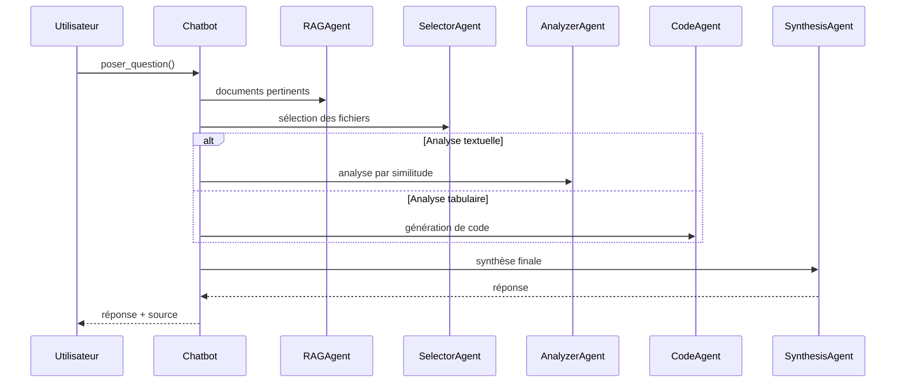

# Chatbot RAG - AMDIE

## Présentation

Ce projet est un **assistant intelligent à base d’IA**, conçu pour répondre de manière fiable et contextualisée aux demandes des utilisateurs de l’AMDIE. Il s’appuie sur une architecture de type **RAG** (Retrieval-Augmented Generation) permettant d’interroger automatiquement une **base vectorielle de documents internes**.

L’objectif est de **centraliser les connaissances** issues de fichiers hétérogènes (PDF, Excel) afin de **réduire la charge des équipes** tout en garantissant des réponses traçables, sécurisées et adaptées au rôle de l’utilisateur.

Projet réalisé dans le cadre d’un **stage de 4ᵉ année d’ingénieur** à l’AMDIE (INSA Rouen - Génie Mathématiques).


<div align="center">
  
</div>

<p align="center">

</p>

---

## Fonctionnement interne (LangGraph)



---

## Technologies utilisées

| Composant        | Technologie                                       |
| ---------------- | ------------------------------------------------- |
| LLM              | Gemini                                            |
| Backend IA       | Python + LangGraph                                |
| Agents           | RAG, Sélecteur, Analyseur, Code, Synthèse         |
| Authentification | Keycloak                                          |
| Base vectorielle | ChromaDB                                          |
| API REST         | FastAPI                                           |
| Frontend         | Next.js + Tailwind + Shadcn                       |

---

## Structure du projet

```
chatbot_maroc/
├── backend_python/        # Agents IA, LangGraph, embeddings
├── message_fastapi/       # API REST (authentification, sessions)
├── mcp-server-amdie/      # Serveur MCP
├── frontend_nextjs/       # Interface utilisateur (Next.js)
├── data/                  # Fichiers sources par niveau d’accès
├── output/                # JSON extraits et indexés
├── docs/                  # Documentation générée avec pdoc
└── README.md              # Présentation du projet
```

---

## Lancement

### 1. Authentification (Keycloak)
Installer Keycloak au préalable ([Keycloak](https://www.keycloak.org/))

```bash
cd keycloak/bin
./kc.sh start-dev --http-port 8080
```

* Utilisateurs: `admin`, `employee`, `public`
* Authentification + vérification JWT dans l’API

---

### 2. API REST (FastAPI)

```bash
cd message_fastapi
python main.py
```

* Documentation Swagger : [http://localhost:8000/docs](http://localhost:8000/docs)
* Sessions stockées dans `/tmp/chatbot_sessions.json`

---

### 3. Serveur MCP (Gemini LLM)

```bash
cd mcp-server-amdie
python mcp_backend_server.py
```

Accessible depuis l’API à l’adresse : `http://0.0.0.0:8090/mcp/`

---

### 4. Interface utilisateur (Next.js)

```bash
cd frontend
npm install
npm run dev
```

Accessible via : [http://localhost:3000](http://localhost:3000)

Connexion redirigée automatiquement vers Keycloak.

---

## Sécurité et contrôle d’accès

Les documents sont classés selon leur niveau de sensibilité :

```
data/
├── admin/      # accès restreint (administrateur uniquement)
├── salarie/    # accès salarié
├── public/     # documents ouverts à tous
```

Les droits sont appliqués à chaque étape :

* **Filtrage lors de l’indexation**
* **Filtrage à la requête (dans LangGraph)**

---

## Documentation et annexes

* Documentation Python générée avec `pdoc` : dossier `docs/`
* Notices utilisateur par rôle :

  * `NOTICE_PUBLIC.md`
  * `NOTICE_SALARIE.md`
  * `NOTICE_ADMIN.md`

---

## Auteur

Réalisé par **Assia AIT TALEB**
Stage de spécialité 4ᵉ année - INSA Rouen Normandie
\
Agence Marocaine de Développement des Investissements et des Exportations (AMDIE)
