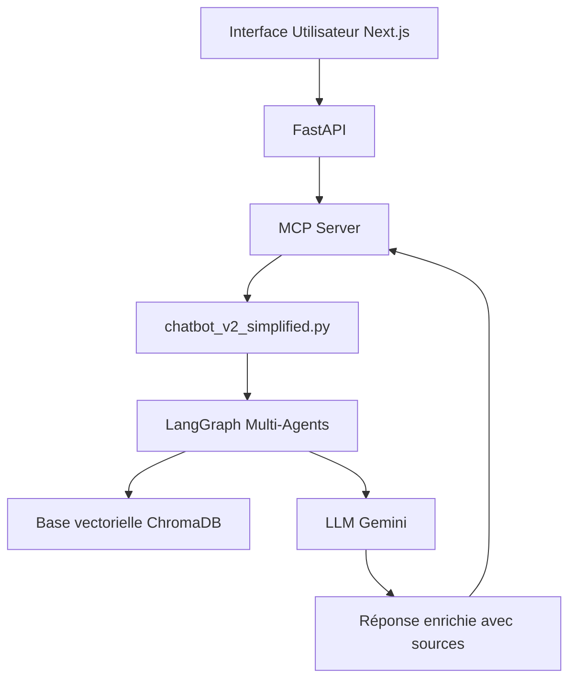

# `backend_python/` — Backend IA du Chatbot AMDIE

Ce module constitue la **colonne vertébrale intelligente** du projet de chatbot RAG développé à l’AMDIE. Il s'appuie sur une **architecture multi-agent** orchestrée par **LangGraph** pour traiter dynamiquement les requêtes utilisateur, en exploitant un LLM (**Gemini**) et une base vectorielle (**ChromaDB**).

Le backend est exécuté **à la demande** via le **serveur MCP**, et il s’adapte automatiquement :

* aux **droits d’accès** de l’utilisateur (`public`, `salarie`, `admin`),
* à la **typologie des fichiers rencontrés** (PDF, Excel, Word, HTML…),
* au **contexte métier** de la requête posée.

---

## Prérequis

Avant de pouvoir exécuter le backend, les éléments suivants doivent être installés et configurés :

* **Python 3.10+**
* **LangGraph** (dernière version stable)
* **ChromaDB** (serveur local ou intégré)
* **SentenceTransformers** (`all-MiniLM-L6-v2` pour les embeddings)
* **Google Generative AI SDK** (Gemini)
* **pandas**, **numpy**, **PyMuPDF**, **python-docx**, **beautifulsoup4** (pour l’analyse de fichiers)
* **SQLite** (utilisé via `memory_store.py`)
* **Clé API Gemini** 
* **Connexion avec le serveur MCP** opérationnelle (`mcp.run(...)`)

Installation des dépendances :

```bash
pip install -r requirements.txt
```

---

## Objectif

Ce backend permet :

* L’analyse sémantique ou tabulaire de documents hétérogènes.
* L’indexation structurée dans **ChromaDB**, enrichie de métadonnées.
* La **génération de réponses contextuelles**, fiables, et traçables.
* Le **filtrage d’accès par permissions**, à chaque étape du pipeline.

Il soulage ainsi les équipes internes en fournissant des réponses automatisées, justifiées par les sources, tout en respectant le périmètre d’accès de chaque utilisateur.

---

## Architecture multi-agent (LangGraph)

Le cœur du backend est défini dans `chatbot_v2_simplified.py`, avec un **graphe LangGraph** orchestrant plusieurs agents spécialisés :

| Agent                  | Rôle                                                             |
| ---------------------- | ---------------------------------------------------------------- |
| `RAGAgentUnified`      | Recherche sémantique vectorielle dans ChromaDB                   |
| `SelectorAgentUnified` | Sélection des documents ou tableaux pertinents                   |
| `AnalyzerAgentUnified` | Analyse sémantique de texte ou de tableaux Excel                 |
| `CodeAgent`            | Génération de code Python (via LLM) pour traitement personnalisé |
| `SimplePandasAgent`    | Exécution de traitements numériques simples sur les tableaux     |
| `SynthesisAgent`       | Rédaction finale de la réponse enrichie des sources (Gemini)     |

---

## Fichiers et dossiers clés

| Emplacement                 | Rôle principal                                                   |
| --------------------------- | ---------------------------------------------------------------- |
| `chatbot_v2_simplified.py`  | Entrée du backend (appelée dynamiquement par MCP)                |
| `rag_agent_unified.py`      | Recherche vectorielle via RAG                                    |
| `selector_agent_unified.py` | Sélection logique des documents ou tableaux pertinents           |
| `analyzer_agent_unified.py` | Analyse unifiée de documents texte                               |
| `code_agent.py`             | Génération de code via LLM pour traitement tabulaire             |
| `pandas_agent.py`           | Exécution via pandas des formules ou calculs simples             |
| `synthesis_agent.py`        | Agent de synthèse finale (réponse contextualisée avec sources)   |
| `memory_store.py`           | Historisation des échanges dans `conversations.db`               |
| `data/`                     | Fichiers bruts (`PDF`, `XLSX`, etc.), classés par niveau d’accès |
| `output/`                   | Données structurées extraites au format `.json`                  |
| `logs/`                     | Traces de traitement, erreurs et messages systèmes               |
| `config/`                   | Configuration générale et du logger                              |

---

## Fonctionnement global

1. L’utilisateur pose une question via le frontend.
2. L’API transmet la requête au **serveur MCP**.
3. Le MCP appelle dynamiquement le fichier `chatbot_v2_simplified.py` avec :

   * La question
   * L’identifiant de session
   * Le rôle de l’utilisateur
   * La liste de permissions (niveau d’accès)
4. Le pipeline se déroule :

   * Sélection des documents autorisés
   * Recherche vectorielle
   * Analyse des documents ou tableaux
   * Génération éventuelle de code Python
   * Synthèse de la réponse avec Gemini
5. La réponse est renvoyée à l’interface avec les sources citées.
6. L’historique est :

   * Temporairement enregistré dans `/tmp/chatbot_sessions.json`
   * Persisté dans `conversations.db` (SQLite)

---

## Lancement automatique (via MCP)

Ce backend **n’est pas lancé manuellement**.

Il est déclenché dynamiquement par le **serveur MCP**, via :

```bash
python mcp_backend_server.py
```

Le MCP exécute :

```python
mcp.run(transport="http", host="0.0.0.0", port=8090, path="/mcp/")
```

---

## Exemple de pipeline



---

## Annexes utiles

* `output/` : fichiers `.json` extraits depuis PDF, Excel…
* `logs/` : journalisation des sessions et erreurs
* `config/` : configuration environnement et journalisation
* `memory_store.py` : mécanisme d’historisation (SQLite)
* `conversations.db` : base de données locale (historique)

---

## Auteur

Projet conçu et développé par **Assia AIT TALEB**
Stage ingénieur 4A – INSA Rouen Normandie – AMDIE (2025)
