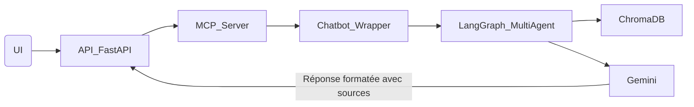

###  `backend_python/` – Backend IA du Chatbot AMDIE

Ce module contient l'intelligence artificielle du chatbot de l’AMDIE. Il est responsable du traitement des questions, de l'analyse des documents, de la vectorisation des données et de la génération des réponses via le LLM Gemini.

---

##  Objectif

Ce backend permet de traiter automatiquement les demandes des utilisateurs via un système multi-agent orchestré par **LangGraph**, interfacé avec le LLM **Gemini**. Il alimente la base vectorielle **ChromaDB** à partir des documents disponibles (PDF et Excel), résumés ou analysés selon leur type, et structurés avant vectorisation.

Le chatbot peut répondre à des questions contextuelles en tenant compte :

* du **rôle de l’utilisateur** (`admin`, `salarié`, `public`),
* de ses **droits d’accès** sur les documents,
* des **sources utilisées**, mentionnées dans la réponse.

Le backend est lancé dynamiquement par le **serveur MCP** à chaque nouvelle requête utilisateur.

---

##  Architecture

### 1. Fichiers clés

| Fichier/Dossier            | Rôle principal                                                                   |
| -------------------------- | -------------------------------------------------------------------------------- |
| `chatbot_wrapper.py`       | Point d’entrée principal, exécute le backend et orchestre les agents.            |
| `chatbot_v2.py`            | Définit la structure LangGraph multi-agent (state, nodes, etc.).                 |
| `questions_essai.py`       | Ancienne version de test, utilisée uniquement pour l’analyse de fichiers Excel.  |
| `src/agents/`              | Contient les agents IA spécialisés (analyse PDF, Excel, résumé, extraction...).  |
| `src/core/`                | Contient les fonctions de logique centrale et d’orchestration.                   |
| `src/rag/`                 | Modules pour le RAG (Retrieval Augmented Generation).                            |
| `src/utils/`               | Fonctions utilitaires diverses.                                                  |
| `scripts/chatbot_essai.py` | Script de test du pipeline.                                                      |
| `config/`                  | Paramètres d’environnement et configuration du logger.                           |
| `data/`                    | Fichiers source classés par niveau de confidentialité (`admin`, `public`, etc.). |
| `output/`                  | Résultats de l’extraction en `.json` (résumés, métadonnées).                     |
| `logs/`                    | Logs du système : erreurs, métriques, messages d'exécution.                      |
| `conversations.db`         | Base SQLite contenant l’historique utilisateur (via `memory_store.py`).          |

---

##  Fonctionnement

1. À chaque question :

   * Le **serveur MCP** appelle `chatbot_wrapper.py` via une fonction asynchrone.
   * Les documents sont sélectionnés selon les **droits d’accès** de l'utilisateur.
   * Pour remplir la base vectorielle, des documents sont analysés ou résumés, puis vectorisés.
   * La **base vectorielle Chroma** est interrogée pour récupérer les passages pertinents.
   * **Gemini** génère une réponse enrichie avec les sources citées.

2. L'historique est :

   * Enregistré dans `/tmp/chatbot_sessions.json` (stockage temporaire partagé entre l’API et le MCP),
   * Persisté dans `conversations.db` pour archivage.

---

##  Lancement

Ce backend **n'est pas lancé manuellement**. Il est invoqué automatiquement par le serveur MCP via :

```python
mcp.run(transport="http", host="0.0.0.0", port=8090, path="/mcp/")
```

---

##  Exemple de cheminement


