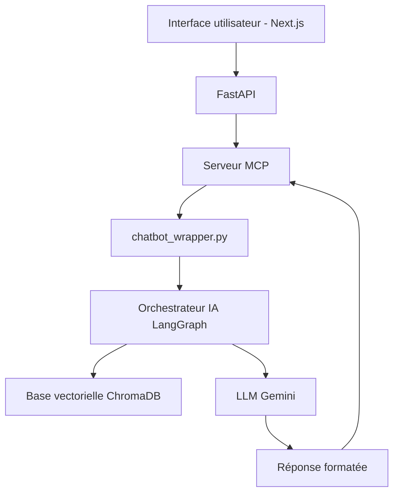

## `mcp-server-amdie/` – Serveur MCP pour le lancement du backend

Ce module contient le **serveur MCP** utilisé pour déclencher dynamiquement le backend IA du chatbot à chaque nouvelle requête utilisateur. Il constitue le **point central d’orchestration** entre l’interface utilisateur, l’API FastAPI, et les agents IA intégrés dans le backend LangGraph.

---

##  Objectif

* Recevoir une requête de l’API FastAPI (question, session, rôle, permissions).
* **Lancer dynamiquement le backend** du chatbot via la fonction `start_backend`.
* Transmettre la réponse finale à l’API, enrichie et contextualisée.
* Servir de **connecteur central** entre le frontend, la base vectorielle et le LLM Gemini.

---

##  Lancement rapide

### Prérequis

* Python 3.10+
* FastAPI installé (pour l’API)
* Uvicorn (lanceur pour FastAPI)
* Client MCP installé ou configuration manuelle
* Clé publique Keycloak disponible si l’authentification OAuth2 est activée

### Lancer le serveur API (FastAPI)

Dans un terminal distinct :

```bash
cd message_fastapi
uvicorn main:app --reload --port 8000
```

Accessible sur : [http://localhost:8000/docs](http://localhost:8000/docs)

---

##  Lancer le serveur MCP

Dans un autre terminal :

```bash
cd mcp-server-amdie
python mcp_backend_server.py
```

Le serveur s’expose à l’API via l’URL :

```
http://0.0.0.0:8090/mcp/
```

Ce serveur est lancé avec la commande suivante :

```python
mcp.run(transport="http", host="0.0.0.0", port=8090, path="/mcp/")
```

---

##  Fonction `start_backend(...)`

Signature de la fonction centrale :

```python
async def start_backend(question: str, session_id: str, permissions_csv: str, role: str, username: str, email: str) -> Dict[str, Any]
```

### Rôle de la fonction :

* Appelle le **backend IA** via `_spawn_wrapper(...)`.
* Délègue le traitement à LangGraph : sélection des documents, vectorisation, RAG, réponse.
* Retourne :

  * La **réponse finale formatée** (par le LLM Gemini)
  * Les **messages de progression** (affichés dans l’interface)
  * Les **sources citées**

---

## Fichiers principaux

| Fichier                     | Rôle                                                                                     |
| --------------------------- | ---------------------------------------------------------------------------------------- |
| `mcp_backend_server.py`     | Configuration du serveur MCP et fonction `start_backend`.                                |
| `serveur.json`              | Fichier de configuration (optionnel, utilisé par MCP Instructor pour simuler des appels) |
| `__init__.py`               | Initialisation du module                                                                 |
| `pyproject.toml`, `uv.lock` | Fichiers de dépendances (si gestion par poetry/pipenv)                                   |

---

## Communication entre composants



>  Tous les échanges passent par le **serveur MCP** : le backend n'est **jamais directement invoqué** par le frontend ou l’API.

---

##  Mode test avec MCP Instructor

Possibilité de tester localement le serveur via **MCP Instructor** :

1. Lancer le serveur (`python mcp_backend_server.py`)
2. Charger un fichier `serveur.json` avec les paramètres de simulation
3. Envoyer des requêtes de test pour simuler une session complète

---

##  Auteur

Projet conçu et développé par **Assia AIT TALEB**,
Stage ingénieur – INSA Rouen Normandie – AMDIE (2025)
